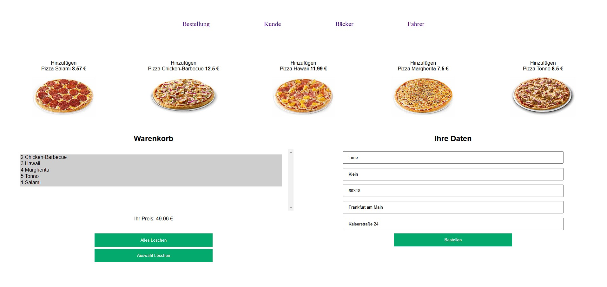
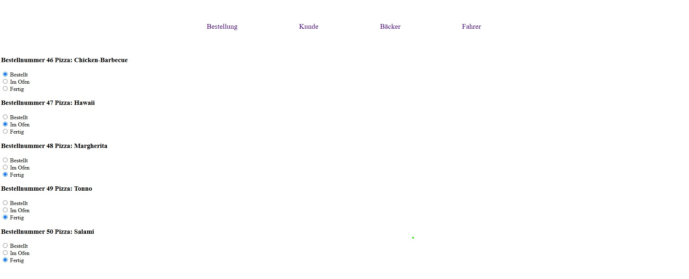
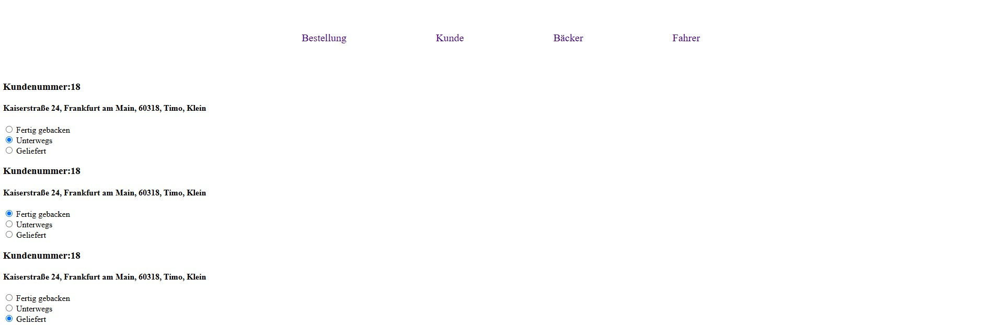
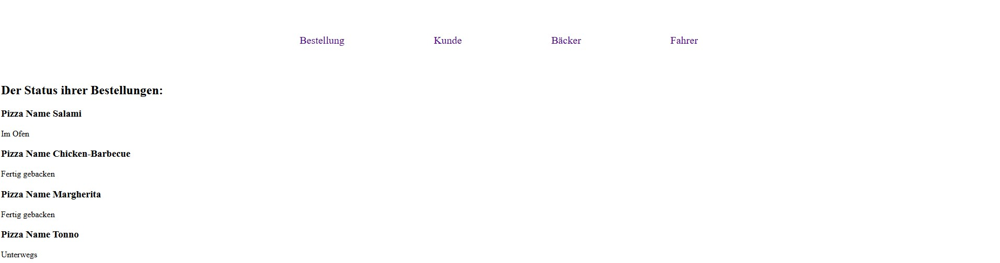

# PizzaService

Ein Webprojekt zur Verwaltung von Pizzabestellungen in verschiedenen Rollen.

## Bestellungsseite

Auf der Bestellungsseite können Kunden Pizzen auswählen und bestellen.

**Funktionalität:**
- Anzeige der verfügbaren Pizzen
- Warenkorbverwaltung via JavaScript
- Eingabefelder für Kundendaten

---

## Bäckerseite

Die Bäckerseite ermöglicht es, den Status der Bestellungen zu aktualisieren.

**Funktionalität:**
- Anzeige der eingehenden Bestellungen
- Aktualisierung des Backstatus (z.B. "Bestellt", "Im Ofen", "Fertig gebacken")

---

## Fahrerseite

Auf der Fahrerseite werden die fertig gebackenen Bestellungen für die Lieferung angezeigt.

**Funktionalität:**
- Anzeige der Lieferbestellungen
- Statuswechsel von "Fertig gebacken" zu "Unterwegs" und "Geliefert"

---

## Kundenseite

Die Kundenseite informiert den Kunden über den aktuellen Bestellstatus.  
Die Statusanzeige wird regelmäßig über AJAX (js/StatusUpdate.js) aktualisiert.

**Funktionalität:**
- Abruf und Anzeige des Bestellstatus über JSON (via `KundenStatus.php`)
- Live-Updates der Bestellung

---

# Datenbank Setup

Man kann die Datenbank ganz einfach mithilfe der beiden SQL-Dateien im Ordner `sql/` aufsetzen:

- **database.sql**: Erstellt die Datenbank und alle notwendigen Tabellen.
- **entries.sql**: Befüllt die erstellten Tabellen mit Testdaten.

Importiere beide Dateien in phpMyAdmin oder führe sie über die Kommandozeile aus, um die Datenbank vollständig einzurichten.